<!-- _class: title -->

# Subagent-Driven Development (SDD)

A complete multi-agent workflow for turning ideas into shipped code.

**7 skills** that chain together: design, plan, execute, review, ship.

---

# The 7 Skills

| # | Skill | Purpose |
|---|-------|---------|
| 1 | `/brainstorming` | Design gate. Explore, question, propose, write spec. |
| 2 | `/writing-plans` | Convert spec into bite-sized TDD implementation plan. |
| 3 | `/subagent-driven-development` | Execute via fresh subagent per task + two-stage review. |
| 4 | `/executing-plans` | Simpler batch execution in a separate session. |
| 5 | `/requesting-code-review` | Dispatch code reviewer with clean context. |
| 6 | `/finishing-a-development-branch` | Verify tests, merge/PR/keep/discard. |
| 7 | `/using-git-worktrees` | Create isolated workspace with safety checks. |

`/using-git-worktrees` runs before any implementation step.

---

# The Workflow



---

# Skill 1: `/brainstorming`

**Hard gate** before any implementation. No code without an approved spec.

1. Explores project context (files, docs, recent commits)
2. Asks clarifying questions (one at a time, multiple choice preferred)
3. Proposes 2-3 approaches with trade-offs
4. Writes spec to `docs/specs/YYYY-MM-DD-<topic>-design.md`
5. Self-reviews for placeholders, contradictions, scope creep
6. User reviews the written spec
7. Transitions to `/writing-plans` (the only exit)

*YAGNI ruthlessly. Design for isolation and clarity.*

---

# Skill 2: `/writing-plans`

Turn approved specs into construction manuals. Assume the implementer has zero codebase context.

### Bite-sized steps (2-5 min each), every step is ONE action:

```
- [ ] Step 1: Write the failing test
      (actual test code here)
- [ ] Step 2: Run it, verify it fails
      Run: pytest tests/test_foo.py -v
      Expected: FAIL with "function not defined"
- [ ] Step 3: Implement minimal code to pass
      (actual implementation code here)
- [ ] Step 4: Run test, verify it passes
- [ ] Step 5: Commit
```

---

# Skill 2: No Placeholders Rule

These are **plan failures**. Never write them:

- "TBD", "TODO", "implement later", "fill in details"
- "Add appropriate error handling"
- "Write tests for the above" (without actual test code)
- "Similar to Task N" (repeat the code)
- Steps that describe what to do without showing how

Every step has: **actual code, exact commands, expected output.**

### Self-Review Checklist

1. Spec coverage: can you point to a task for every requirement?
2. Placeholder scan: any red flag patterns?
3. Type consistency: do names match across tasks?

---

# Skill 3: `/subagent-driven-development`

Execute the plan in the current session. Fresh subagent per task.
Two-stage review after each.



---

# Skill 3: Model Selection

Use the least powerful model that can handle each role:

| Task Type | Signal | Model |
|-----------|--------|-------|
| Mechanical | 1-2 files, clear spec, isolated | Fast/cheap (Sonnet) |
| Integration | Multi-file, coordination needed | Standard (Sonnet) |
| Architecture/Review | Design judgment, broad context | Most capable (Opus) |

### Implementer Status Handling

| Status | Action |
|--------|--------|
| **DONE** | Proceed to spec review |
| **DONE_WITH_CONCERNS** | Read concerns, address if needed |
| **NEEDS_CONTEXT** | Provide missing info, re-dispatch |
| **BLOCKED** | More context, better model, or smaller pieces |

---

# Skill 4: `/executing-plans`

Simpler alternative. Separate session, batch mode, periodic review checkpoints.

### Process

1. Load and critically review the plan
2. Raise concerns before starting
3. For each task: mark in-progress, follow steps exactly, run verifications
4. **Red/green TDD for every task** (tests before implementation, always)
5. When done: `/finishing-a-development-branch`

### When to Stop

- Hit a blocker (missing dependency, test fails, unclear instruction)
- Plan has critical gaps
- Verification fails repeatedly

*Ask for clarification rather than guessing.*

---

# Skill 5: `/requesting-code-review`

### When (mandatory)

- After each task in subagent-driven development
- After completing a major feature
- Before merge to main

### How

1. Get git SHAs (base and head)
2. Dispatch code-reviewer subagent with: what was built, the plan, the diff

### Output

- **Strengths** (be specific)
- **Issues**: Critical (must fix) / Important (should fix) / Minor (nice to have)
- **Assessment**: Ready to merge? Yes / No / With fixes

---

# Skill 6: `/finishing-a-development-branch`

### Process

1. **Verify tests pass** (cannot proceed if they fail)
2. **Determine base branch**
3. **Present exactly 4 options:**

| Option | What Happens |
|--------|-------------|
| 1. Merge locally | Checkout base, pull, merge, test merged result, delete branch |
| 2. Push + PR | Push with -u, `gh pr create`, display URL |
| 3. Keep as-is | Report status, leave worktree |
| 4. Discard | Requires typed confirmation, deletes branch |

4. **Cleanup worktree** (for options 1, 2, 4)

---

# Skill 7: `/using-git-worktrees`

Isolated workspace with safety verification.

### Directory Selection
1. Check for `.worktrees/` (preferred) or `worktrees/`
2. Check CLAUDE.md for preference
3. Ask user

### Safety (Critical)
Verify directory is in `.gitignore` before creating. If not, add it and commit first.

### Setup
Auto-detects project type and runs the appropriate install command
(`npm install`, `pip install`, `cargo build`, `go mod download`).
Then runs baseline tests to verify clean state.

---

# Design Principles

1. **Design-first gate**: no code without an approved spec
2. **Two-stage review**: spec compliance (right thing?) then code quality (built well?)
3. **Red/green TDD**: unconditional. Tests before implementation, always.
4. **No placeholders**: every plan step has real code, real commands, expected output
5. **Fresh subagents per task**: prevents context pollution
6. **Bite-sized steps**: 2-5 min granularity, one action per step
7. **Isolation via worktrees**: no branch-switching confusion
8. **YAGNI**: remove unnecessary features ruthlessly

---

# Summary

The design stays the **source of truth**.
The construction manual is **disposable** and regenerated per milestone.

### For each milestone:

`/writing-plans` &rarr; `/using-git-worktrees` &rarr; `/subagent-driven-development` &rarr; `/finishing-a-development-branch`

### What SDD enforces:

- No code without a spec (brainstorming gate)
- No implementation without a plan (writing-plans gate)
- Red/green TDD on every task (unconditional)
- Two-stage review after every task (spec + quality)
- Fresh context per task (no pollution)
- Clean finish (tests, merge/PR, worktree cleanup)
